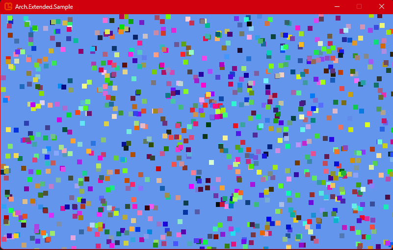

# Arch.Samples

Sometimes a simple example can be more effective than a whole documentary. That's why [Arch.Samples](https://github.com/genaray/Arch/tree/master/src/Arch.Samples) exists, a small monogamous project that shows how Arch can work.

<figure><figcaption></figcaption></figure>


The whole code is available on [git](https://github.com/genaray/Arch/tree/master/src/Arch.Samples), check it out! With **`O`** you make sure that all entities stop moving, with `I` that it continues. With `K` you add more entities and with `L` you remove some again.

